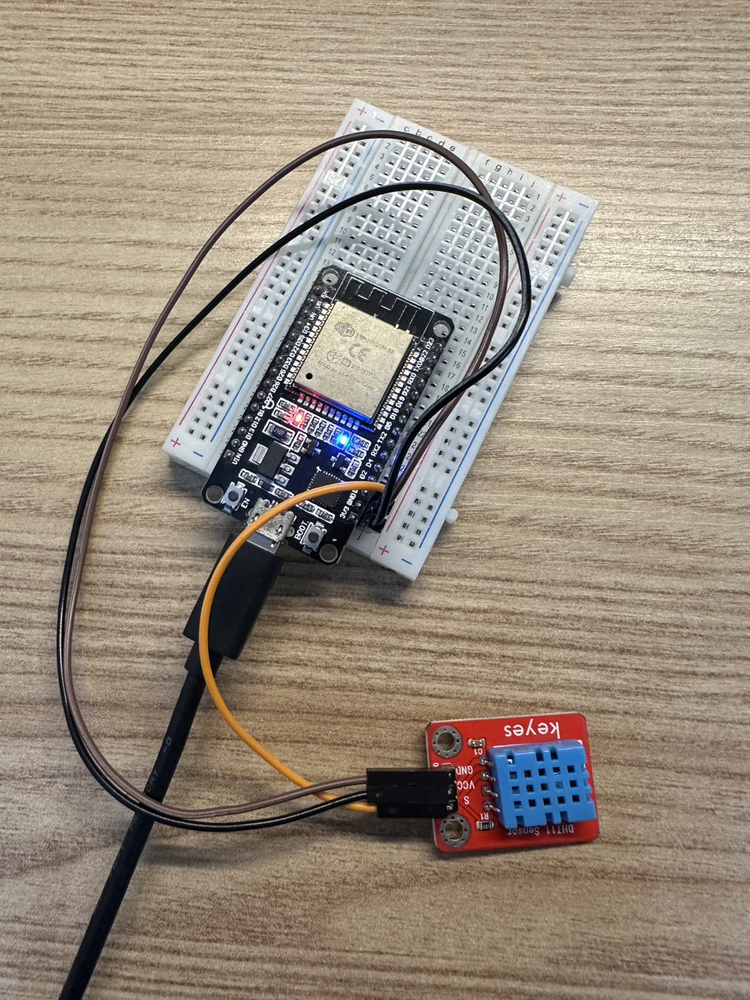
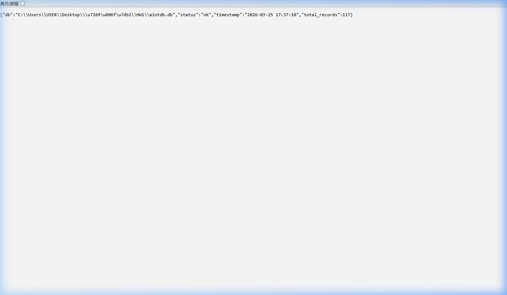
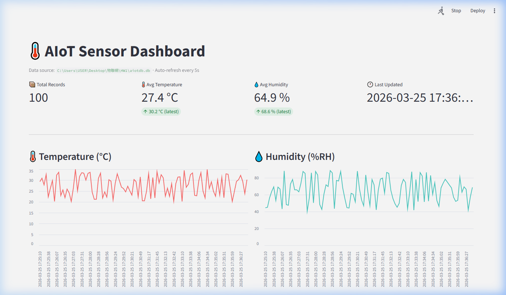
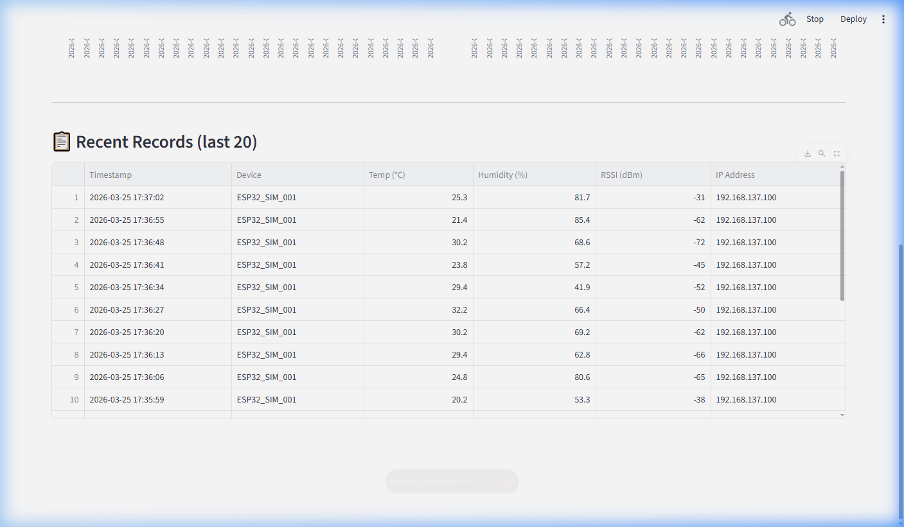

# HW1: AIoT Sensor Monitoring System

This repository contains the complete codebase for a local **AIoT (Artificial Intelligence of Things) Sensor Monitoring Pipeline**. It demonstrates how to collect environmental data from an ESP32 microcontroller, transmit it via WiFi, store it locally using SQLite, and visualize the findings through a real-time web dashboard.

## 🌟 Demo

### Hardware Status


### Software Dashboards
| Flask `/health` Endpoint | Streamlit Dashboard |
| --- | --- |
|  |  |
| **Raw Sensor Data Table** |
|  |

---

## 🏗️ System Architecture

1.  **ESP32 Edge Device**: Reads temperature & humidity using a DHT11 sensor and sends the data periodically via HTTP JSON POST.
2.  **Flask Backend (`app.py`)**: Receives data via the `/sensor` endpoint and persists it locally.
3.  **Local Database (`aiotdb.db`)**: Lightweight SQLite3 database.
4.  **Local Simulator (`esp32_sim.py`)**: Generates and POSTs simulated sensor telemetry + WiFi metadata when physical hardware is unavailable.
5.  **Streamlit Visualization (`dashboard.py`)**: Automatically refreshes every 5 seconds to display KPI cards, historical trend charts, and the latest sensor datasets.

---

## 🛠️ Tech Stack
- **Hardware Integration**: Arduino (C++), ESP32, DHT11 Sensor
- **Backend API**: Python 3, Flask, HTTP Requests
- **Database**: SQLite3
- **Frontend / Visualization**: Streamlit, Pandas

## 🚀 How to Run locally

### 1. Set up the Environment
Ensure you have Python configured locally, then run the installer:
```bash
python -m venv venv
# On Windows:
.\venv\Scripts\activate
# Install requirements
pip install -r requirements.txt
```

### 2. Start the Services
Run the following commands in three independent terminal windows (with your `venv` activated) inside the `Python_Server` folder:

**Terminal 1: Start the Backend Database Server**
```bash
cd Python_Server
python app.py
```

**Terminal 2: Start the Physical Device OR the Simulator**
```bash
cd Python_Server
# If you don't have an ESP32 connected:
python esp32_sim.py
```

**Terminal 3: Start the Streamlit Dashboard**
```bash
cd Python_Server
streamlit run dashboard.py
```

### 3. Verification
- Flask API logs: http://localhost:5000/health
- Web Dashboard: http://localhost:8501

---

## 📝 Additional Documentation
For an in-depth chronological breakdown of the setup, debugging log, API schemas, and known bug resolutions, please review the included **[SYSTEM_REPORT.md](Docs/SYSTEM_REPORT.md)** document.
